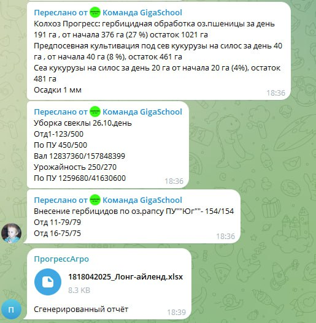

# Прогресс Агро 🌟

Проект реализует заполнение таблиц для агрономов, при помощи анализа сообщений в телеграмм групппе. 
Это решение отлавливает спам, предоставляет большую возможность для маштабирования, а так же улучшения функционала при помощи Yandex cloud Ml SDK

---

## Содержание
- [Установка](#установка)
- [Использование](#использование)
- [Примеры](#примеры)
- [Структура проекта](#структура-проекта)

---

# Установка

Требования:
- Python 3.10+
- pip

```bash

# Клонировать репозиторий
git clone https://github.com/yourusername/projectname.git

# Перейти в директорию проекта
cd projectname

# Установить зависимости
pip install -r requirements.txt
```

---

# Использование

## Быстрый старт
Для десктопных приложений

```bash

# Запуск проекта
py run.py
```
---

# Примеры



*Рис. 1: Пример отправки таблицы для главного агронома*

---
# Структура проекта

```
RosAgro
├── model                   # Исходный код      
│   ├── data/
│   ├── processed_data/ 
│   ├── assistant.py
│   ├── excel.py
│   └── google_drive.py
├── docs/                   # Документация
├── func_tests/             # Тесты
├── view                    # Исходный код 
│   └── controller.py
├── requirements.txt        # Зависимости
├── run.py                  # Запуск программы
└── README.md               # Этот файл
```

---
